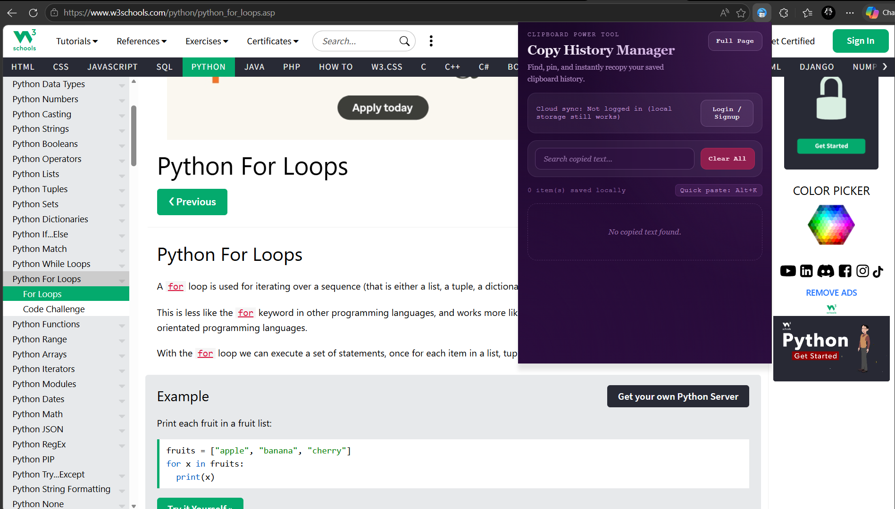
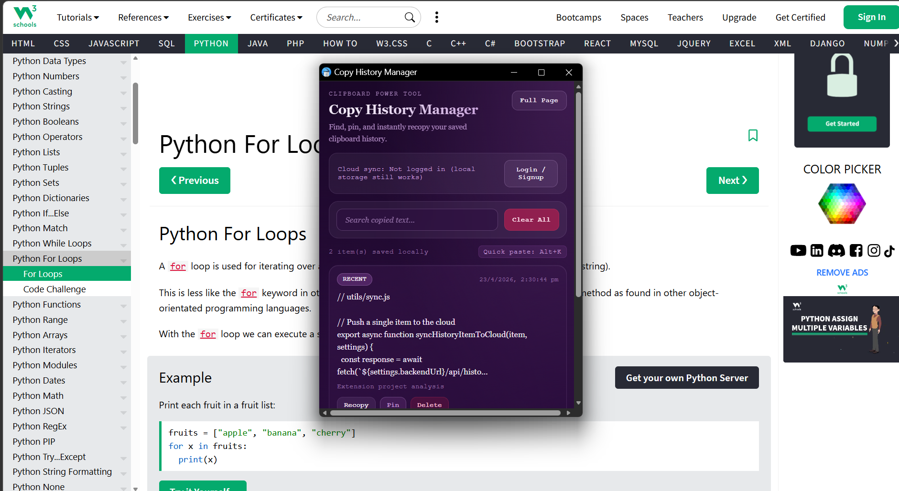
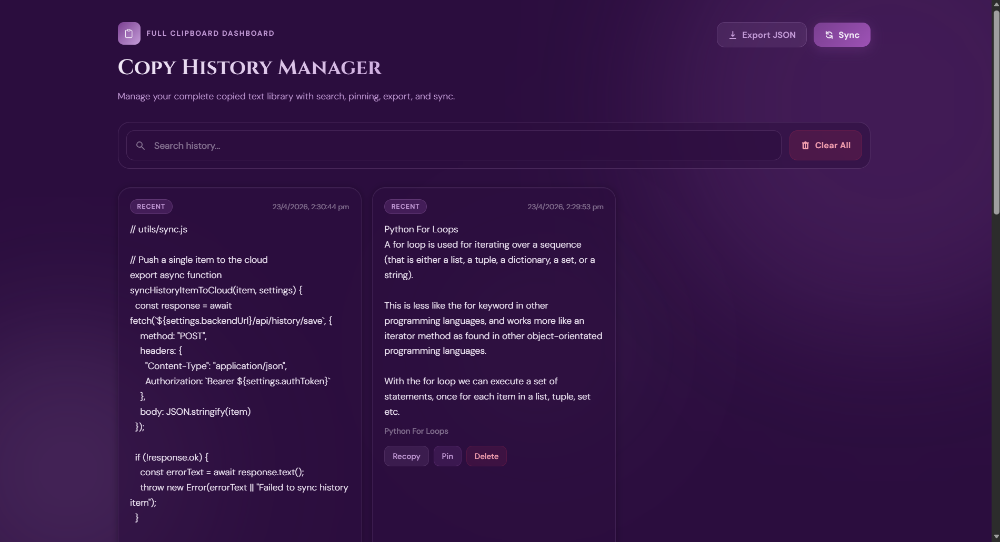
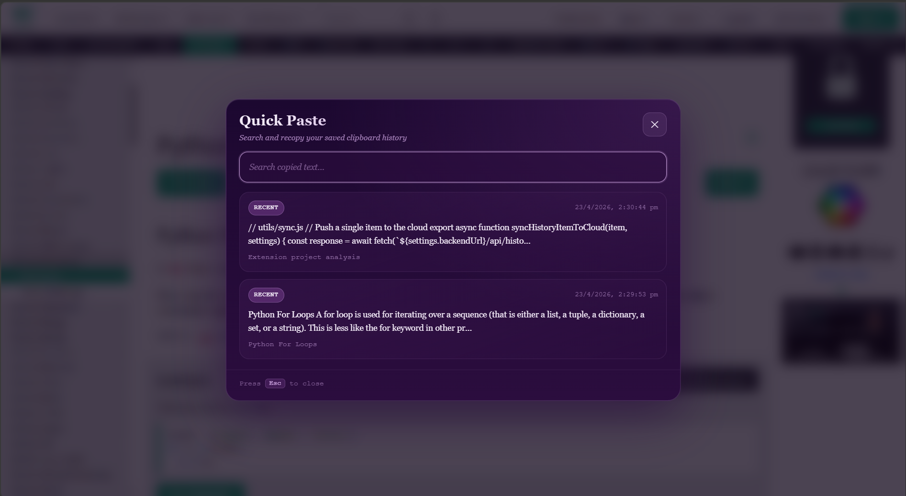
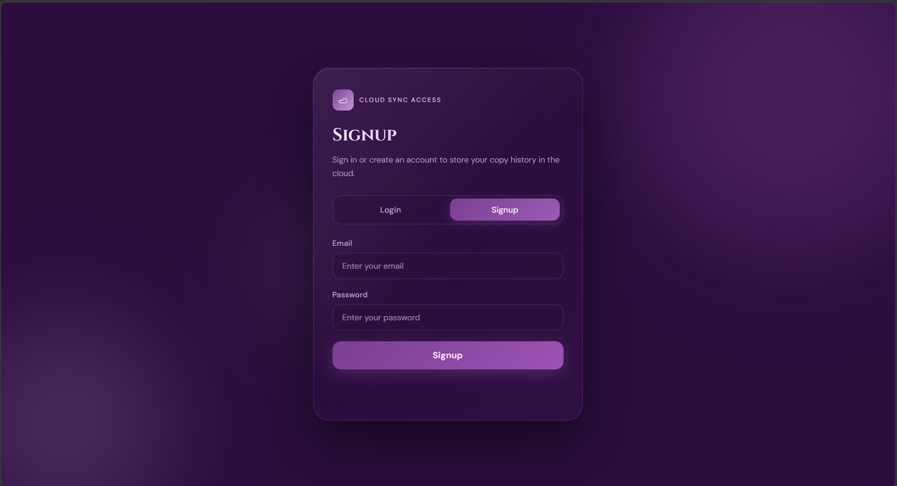
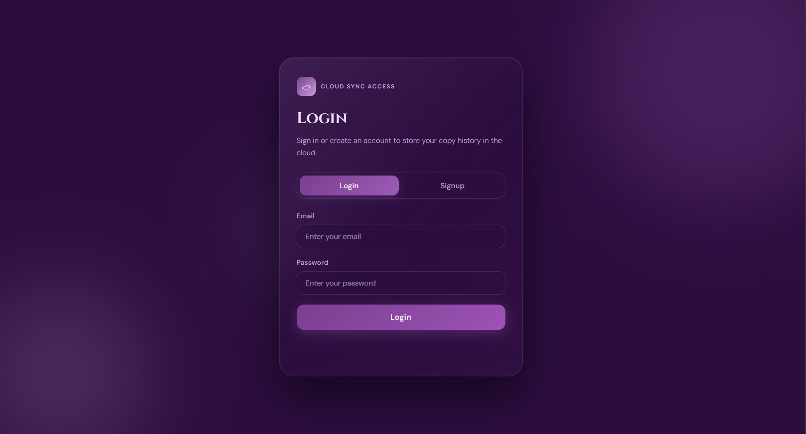

<div align="center">

# Copy History Manager

### A browser extension for Chrome & Microsoft Edge that automatically saves your clipboard history — locally and in the cloud.

**[Live Backend API](https://copy-history-manager.onrender.com)** · **[API Docs](https://copy-history-manager.onrender.com/docs)** · **[Privacy Policy](https://github.com/manikandan-mk007/Copy-History-Manager/blob/main/PRIVACY_POLICY.md)** · **[License](https://github.com/manikandan-mk007/Copy-History-Manager/blob/main/LICENSE)**

</div>

---

## What is Copy History Manager?

Every time you copy something new, your previous clipboard content is gone forever. **Copy History Manager** fixes that.

It is a browser extension for **Chrome and Microsoft Edge** that silently tracks everything you copy — from regular websites and AI tools alike — and stores it in a searchable, persistent local history. Optionally, you can sign in to sync your history to the cloud and restore it across devices.


## Microsoft Edge Extension Link
```base
https://microsoftedge.microsoft.com/addons/detail/dkkkaogcgdnpnfcijpjldnadjbjjopme
```


## Features at a Glance

| Feature | Description |
|---|---|
|  **Auto Copy Tracking** | Captures text on every copy action automatically |
|  **AI Site Support** | Intercepts programmatic clipboard writes from ChatGPT, Gemini, Claude, Perplexity, Grok, and more |
|  **Local Storage** | All data stored locally via `chrome.storage.local` — works fully offline |
|  **Cloud Sync** | Sign in to back up and restore history across multiple devices |
|  **Search & Filter** | Search by copied text, page title, or source URL |
|  **Pin Items** | Pin important entries so they always stay at the top |
|  **Duplicate Handling** | Detects duplicates, increments copy count, and refreshes timestamp instead of creating new entries |
|  **Quick Paste Modal** | Open a floating paste panel inside any page with a keyboard shortcut |
|  **Export History** | Download your full clipboard history as a JSON file |
|  **Configurable Settings** | Control storage limits, blocked domains, duplicate handling, and more |


##  Screenshots

| View | Preview |
|---|---|
| Extension Icon |  |
| Popup UI |  |
| History Page |  |
| Quick Paste Modal |  |
| Sign Up |  |
| Login |  |


## Keyboard shortcuts
Current shortcut commands include:

- **Alt + O** → open popup window
- **Alt + H** → open full history page
- **Alt + Y** → toggle tracking
- **Alt + K** → open quick paste modal


## Tech Stack

- **Extension frontend:** JavaScript, HTML, CSS, Manifest V3
- **Backend API:** FastAPI
- **Database:** SQLite for local development, PostgreSQL-ready for deployment
- **Authentication:** JWT-based login and signup


## Project Structure

```text
copy-history-manager/
├── backend/
│   ├── main.py
│   ├── database.py
│   ├── models.py
│   ├── schemas.py
│   ├── requirements.txt
│   ├── routes/
│   │   ├── auth.py
│   │   ├── history.py
│   │   └── settings.py
│   └── services/
│       ├── auth_service.py
│       └── history_service.py
│
└── extension(Edge & Chrome)/
    ├── manifest.json
    ├── background.js
    ├── content.js
    ├── auth/
    ├── popup/
    ├── options/
    ├── pages/
    ├── modal/
    ├── utils/
    └── icons/
```


## How It Works

### Extension Flow

```
User copies text
      │
      ▼
Content script detects copy event
(standard copy OR intercepted programmatic clipboard write)
      │
      ▼
Message sent to background.js
(text + source URL + page title)
      │
      ▼
Background script validates
(tracking enabled? domain blocked? duplicate?)
      │
      ▼
Item saved to chrome.storage.local
      │
      ▼
Popup / History Page reads and renders items
      │
      ▼
(If logged in) Sync to cloud backend
```

### Cloud Sync Flow

```
User signs up / logs in
      │
      ▼
Backend returns JWT token
      │
      ▼
Token stored in extension auth storage
      │
      ▼
Local history pushed to cloud
      │
      ▼
Cloud history pulled back
      │
      ▼
Both histories merged locally
```


## Backend API Reference

**Base URL (Production):** [`https://copy-history-manager.onrender.com`](https://copy-history-manager.onrender.com)

**Interactive Docs:** [`https://copy-history-manager.onrender.com/docs`](https://copy-history-manager.onrender.com/docs)

### Auth — `/api/auth`

| Method | Endpoint | Description |
|---|---|---|
| `POST` | `/register` | Create a new user and receive JWT |
| `POST` | `/login` | Authenticate and receive JWT |

### History — `/api/history`

| Method | Endpoint | Description |
|---|---|---|
| `POST` | `/save` | Save a single item to the cloud |
| `POST` | `/import` | Bulk import all local items |
| `GET` | `/` | Retrieve cloud history for the logged-in user |

### Settings — `/api/settings`

| Method | Endpoint | Description |
|---|---|---|
| `GET` | `/` | Fetch user settings |
| `POST` | `/` | Save user settings |


## Local Development Setup

### 1. Backend Setup

Navigate to the `backend` folder and follow the steps below.

**Create and activate a virtual environment:**

```bash
# Create
python -m venv venv

# Activate — Windows
venv\Scripts\activate

# Activate — Mac/Linux
source venv/bin/activate
```

**Install dependencies:**

```bash
pip install -r requirements.txt
```

**Start the development server:**

```bash
uvicorn main:app --reload
```

The backend will be available at:

```
http://127.0.0.1:8000
```

API documentation at:

```
http://127.0.0.1:8000/docs
```


### 2. Extension Setup

1. Open **Chrome** or **Microsoft Edge**
2. Navigate to the extensions management page:
   - Chrome → `chrome://extensions/`
   - Edge → `edge://extensions/`
3. Enable **Developer mode** (toggle in the top right)
4. Click **Load unpacked**
5. Select the folder: `extension(Edge & Chrome)`
6. Open **Extension Options** and set the backend URL:

```
http://127.0.0.1:8000
```

> For production use, set the backend URL to: `https://copy-history-manager.onrender.com`


## Usage Guide

### Local-Only Mode
1. Load the extension into your browser
2. Copy any text on any webpage
3. Click the extension icon to open the popup
4. Browse, search, pin, recopy, or delete items

### Cloud Sync Mode
1. Open the auth page from the popup
2. Sign up or log in
3. Your local history is automatically uploaded
4. History is merged with any existing cloud data
5. All future copied items sync in real time

### Full History Page
Access via `Alt + H` or the popup button. Supports:
- Full-text search across all entries
- Pin / unpin items
- Delete individual items or clear all
- Export entire history as JSON
- Manual cloud sync

### Quick Paste Modal
Press `Alt + K` on any page to open a floating modal with your most recent items. Click any item to instantly copy it again.


## Contributing

Contributions, issues, and feature requests are welcome. Feel free to open a pull request or issue on the repository.


##  Privacy

This extension only stores clipboard data locally on your device by default. Cloud sync is entirely opt-in and requires explicit login. No data is collected or shared without user action.

→ Read the full [Privacy Policy](https://github.com/manikandan-mk007/Copy-History-Manager/blob/main/PRIVACY_POLICY.md)


##  License

This project is licensed under the terms described in the [LICENSE](https://github.com/manikandan-mk007/Copy-History-Manager/blob/main/LICENSE) file.


##  Author

**Thangamanikandan I**

[](mailto:thangamanikandan.it@gmail.com)


<div align="center">

Made with  by Thangamanikandan I

</div>
